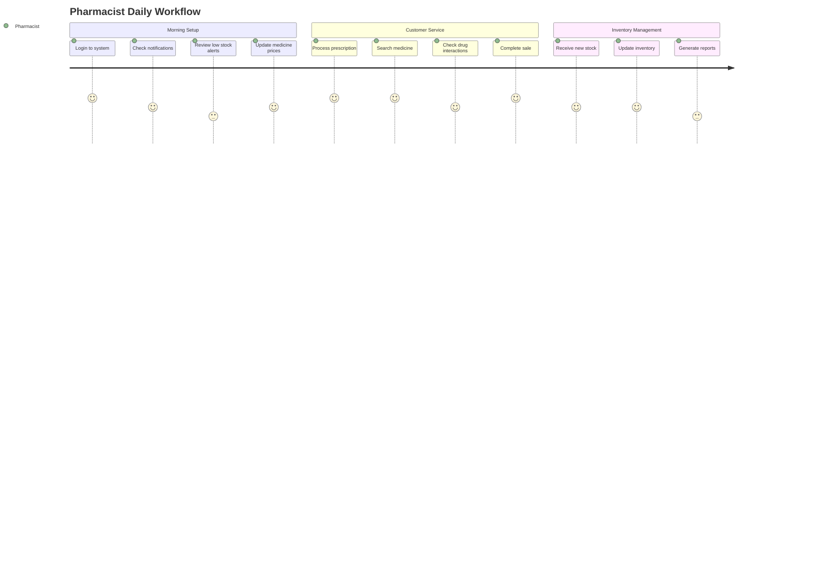

# Q-Pharmacy UI/UX Guidelines

## Overview

Panduan UI/UX ini menyediakan standar dan best practices untuk menciptakan pengalaman pengguna yang konsisten, intuitif, dan efisien di aplikasi Q-Pharmacy. Dokumen ini melengkapi Design System dengan fokus pada interaksi pengguna dan alur kerja.

## Table of Contents

1. [Design Principles](#design-principles)
2. [Navigation Patterns](#navigation-patterns)
3. [User Journey Mapping](#user-journey-mapping)
4. [Layout Patterns](#layout-patterns)
5. [Interaction Patterns](#interaction-patterns)
6. [Form Design Guidelines](#form-design-guidelines)
7. [Data Visualization](#data-visualization)
8. [Mobile-First Approach](#mobile-first-approach)
9. [Performance Guidelines](#performance-guidelines)
10. [Error Handling](#error-handling)

## Design Principles

### 1. Clarity First
- **Clear Information Hierarchy**: Gunakan typography dan spacing yang konsisten
- **Scannable Content**: Organisir informasi dalam chunks yang mudah dipahami
- **Progressive Disclosure**: Tampilkan informasi penting terlebih dahulu

### 2. Efficiency
- **Minimal Clicks**: Kurangi jumlah langkah untuk menyelesaikan tugas
- **Smart Defaults**: Berikan nilai default yang masuk akal
- **Bulk Actions**: Sediakan opsi untuk operasi massal

### 3. Consistency
- **Pattern Reuse**: Gunakan komponen dan pattern yang sama di seluruh aplikasi
- **Predictable Behavior**: Interaksi yang sama harus menghasilkan hasil yang sama
- **Visual Consistency**: Ikuti design system secara konsisten

### 4. Accessibility
- **Inclusive Design**: Desain untuk semua pengguna, termasuk yang memiliki keterbatasan
- **Keyboard Navigation**: Semua fungsi dapat diakses via keyboard
- **Screen Reader Support**: Gunakan semantic HTML dan ARIA labels

## Navigation Patterns

### Primary Navigation

```vue
<!-- Main Navigation Structure -->
<template>
  <q-layout view="lHh Lpr lFf">
    <!-- Header -->
    <q-header elevated class="bg-primary text-white">
      <q-toolbar>
        <q-btn flat dense round icon="menu" @click="toggleLeftDrawer" />
        <q-toolbar-title>Q-Pharmacy</q-toolbar-title>
        <q-space />
        <!-- User menu, notifications, etc -->
      </q-toolbar>
    </q-header>

    <!-- Left Drawer (Main Navigation) -->
    <q-drawer
      v-model="leftDrawerOpen"
      show-if-above
      bordered
      class="bg-grey-1"
    >
      <q-list>
        <!-- Dashboard -->
        <q-item clickable v-ripple to="/dashboard">
          <q-item-section avatar>
            <q-icon name="dashboard" />
          </q-item-section>
          <q-item-section>Dashboard</q-item-section>
        </q-item>

        <!-- Inventory Management -->
        <q-expansion-item icon="inventory" label="Inventory">
          <q-item clickable v-ripple to="/medicines">
            <q-item-section avatar>
              <q-icon name="medication" />
            </q-item-section>
            <q-item-section>Medicines</q-item-section>
          </q-item>
          <q-item clickable v-ripple to="/categories">
            <q-item-section avatar>
              <q-icon name="category" />
            </q-item-section>
            <q-item-section>Categories</q-item-section>
          </q-item>
        </q-expansion-item>

        <!-- Sales -->
        <q-expansion-item icon="point_of_sale" label="Sales">
          <q-item clickable v-ripple to="/pos">
            <q-item-section avatar>
              <q-icon name="shopping_cart" />
            </q-item-section>
            <q-item-section>Point of Sale</q-item-section>
          </q-item>
          <q-item clickable v-ripple to="/orders">
            <q-item-section avatar>
              <q-icon name="receipt" />
            </q-item-section>
            <q-item-section>Orders</q-item-section>
          </q-item>
        </q-expansion-item>
      </q-list>
    </q-drawer>

    <!-- Page Content -->
    <q-page-container>
      <router-view />
    </q-page-container>
  </q-layout>
</template>
```

### Breadcrumb Navigation

```vue
<template>
  <q-breadcrumbs class="q-mb-md">
    <q-breadcrumbs-el label="Dashboard" icon="home" to="/dashboard" />
    <q-breadcrumbs-el label="Inventory" to="/inventory" />
    <q-breadcrumbs-el label="Medicines" />
  </q-breadcrumbs>
</template>
```

### Tab Navigation

```vue
<template>
  <q-tabs v-model="tab" class="text-primary">
    <q-tab name="details" label="Medicine Details" />
    <q-tab name="stock" label="Stock Information" />
    <q-tab name="history" label="Transaction History" />
  </q-tabs>

  <q-tab-panels v-model="tab" animated>
    <q-tab-panel name="details">
      <!-- Medicine details content -->
    </q-tab-panel>
    <q-tab-panel name="stock">
      <!-- Stock information content -->
    </q-tab-panel>
    <q-tab-panel name="history">
      <!-- Transaction history content -->
    </q-tab-panel>
  </q-tab-panels>
</template>
```

## User Journey Mapping

### 1. Pharmacist Daily Workflow



### 2. Customer Purchase Journey

**Scenario**: Customer dengan resep dokter

1. **Entry Point**: Customer datang dengan resep
2. **Prescription Verification**: Pharmacist memverifikasi resep
3. **Medicine Search**: Cari obat di sistem
4. **Stock Check**: Verifikasi ketersediaan stok
5. **Drug Interaction Check**: Periksa interaksi obat
6. **Price Calculation**: Hitung total harga
7. **Payment Processing**: Proses pembayaran
8. **Receipt Generation**: Cetak struk
9. **Medicine Dispensing**: Serahkan obat dengan instruksi

### 3. Admin Management Journey

**Scenario**: Admin mengelola sistem

1. **System Monitoring**: Monitor performa sistem
2. **User Management**: Kelola akun pengguna
3. **Report Generation**: Generate laporan berkala
4. **System Configuration**: Update pengaturan sistem
5. **Backup Management**: Kelola backup data

## Layout Patterns

### 1. Dashboard Layout

```vue
<template>
  <q-page class="q-pa-lg">
    <!-- Page Header -->
    <div class="row items-center q-mb-xl">
      <div class="col">
        <h1 class="text-h4 text-weight-light q-ma-none">Dashboard</h1>
        <p class="text-grey-7 q-ma-none">Welcome back, {{ user.name }}</p>
      </div>
      <div class="col-auto">
        <q-btn color="primary" icon="add" label="Quick Sale" />
      </div>
    </div>

    <!-- Key Metrics -->
    <div class="row q-gutter-lg q-mb-xl">
      <div class="col-12 col-md-3">
        <q-card class="metric-card">
          <q-card-section>
            <div class="text-h6 text-positive">{{ todaySales }}</div>
            <div class="text-caption text-grey-7">Today's Sales</div>
          </q-card-section>
        </q-card>
      </div>
      <!-- More metric cards -->
    </div>

    <!-- Main Content Grid -->
    <div class="row q-gutter-lg">
      <div class="col-12 col-lg-8">
        <!-- Recent Orders -->
        <q-card class="q-mb-lg">
          <q-card-section>
            <div class="text-h6 q-mb-md">Recent Orders</div>
            <!-- Orders table -->
          </q-card-section>
        </q-card>
      </div>
      
      <div class="col-12 col-lg-4">
        <!-- Low Stock Alerts -->
        <q-card>
          <q-card-section>
            <div class="text-h6 q-mb-md">Low Stock Alerts</div>
            <!-- Alert list -->
          </q-card-section>
        </q-card>
      </div>
    </div>
  </q-page>
</template>
```

### 2. List/Table Layout

```vue
<template>
  <q-page class="q-pa-lg">
    <!-- Page Header with Actions -->
    <div class="row items-center q-mb-lg">
      <div class="col">
        <h1 class="text-h5 q-ma-none">Medicine Inventory</h1>
      </div>
      <div class="col-auto">
        <q-btn color="primary" icon="add" label="Add Medicine" />
      </div>
    </div>

    <!-- Filters and Search -->
    <q-card class="q-mb-lg">
      <q-card-section>
        <div class="row q-gutter-md">
          <div class="col-12 col-md-4">
            <q-input v-model="search" placeholder="Search medicines..." outlined dense>
              <template v-slot:prepend>
                <q-icon name="search" />
              </template>
            </q-input>
          </div>
          <div class="col-12 col-md-3">
            <q-select v-model="categoryFilter" :options="categories" label="Category" outlined dense />
          </div>
          <div class="col-12 col-md-3">
            <q-select v-model="statusFilter" :options="statusOptions" label="Status" outlined dense />
          </div>
          <div class="col-12 col-md-2">
            <q-btn color="primary" icon="filter_list" label="Filter" />
          </div>
        </div>
      </q-card-section>
    </q-card>

    <!-- Data Table -->
    <q-card>
      <q-table
        :rows="medicines"
        :columns="columns"
        row-key="id"
        :pagination="pagination"
        :loading="loading"
        @request="onRequest"
      >
        <!-- Custom slots for actions -->
        <template v-slot:body-cell-actions="props">
          <q-td :props="props">
            <q-btn flat round color="primary" icon="edit" size="sm" />
            <q-btn flat round color="negative" icon="delete" size="sm" />
          </q-td>
        </template>
      </q-table>
    </q-card>
  </q-page>
</template>
```

### 3. Form Layout

```vue
<template>
  <q-page class="q-pa-lg">
    <div class="row justify-center">
      <div class="col-12 col-md-8 col-lg-6">
        <q-card>
          <q-card-section>
            <div class="text-h6">Add New Medicine</div>
          </q-card-section>

          <q-card-section>
            <q-form @submit="onSubmit" class="q-gutter-md">
              <!-- Basic Information -->
              <div class="text-subtitle2 text-grey-8 q-mb-sm">Basic Information</div>
              
              <q-input
                v-model="form.name"
                label="Medicine Name *"
                outlined
                :rules="[val => !!val || 'Name is required']"
              />
              
              <div class="row q-gutter-md">
                <div class="col">
                  <q-select
                    v-model="form.category"
                    :options="categories"
                    label="Category *"
                    outlined
                  />
                </div>
                <div class="col">
                  <q-input
                    v-model="form.barcode"
                    label="Barcode"
                    outlined
                  />
                </div>
              </div>

              <!-- Pricing -->
              <div class="text-subtitle2 text-grey-8 q-mb-sm q-mt-lg">Pricing</div>
              
              <div class="row q-gutter-md">
                <div class="col">
                  <q-input
                    v-model.number="form.purchase_price"
                    label="Purchase Price *"
                    type="number"
                    outlined
                    prefix="Rp"
                  />
                </div>
                <div class="col">
                  <q-input
                    v-model.number="form.selling_price"
                    label="Selling Price *"
                    type="number"
                    outlined
                    prefix="Rp"
                  />
                </div>
              </div>

              <!-- Actions -->
              <div class="row q-gutter-sm q-mt-lg">
                <q-btn label="Cancel" color="grey" flat @click="$router.go(-1)" />
                <q-space />
                <q-btn label="Save" type="submit" color="primary" />
              </div>
            </q-form>
          </q-card-section>
        </q-card>
      </div>
    </div>
  </q-page>
</template>
```

## Interaction Patterns

### 1. Loading States

```vue
<template>
  <!-- Button Loading -->
  <q-btn 
    :loading="submitting" 
    label="Save" 
    color="primary" 
    @click="save"
  >
    <template v-slot:loading>
      <q-spinner-hourglass class="on-left" />
      Saving...
    </template>
  </q-btn>

  <!-- Table Loading -->
  <q-table
    :rows="data"
    :columns="columns"
    :loading="loading"
  >
    <template v-slot:loading>
      <q-inner-loading showing color="primary" />
    </template>
  </q-table>

  <!-- Page Loading -->
  <q-page v-if="!pageLoaded" class="flex flex-center">
    <q-spinner-dots color="primary" size="50px" />
  </q-page>
</template>
```

### 2. Confirmation Dialogs

```vue
<template>
  <q-btn 
    label="Delete" 
    color="negative" 
    @click="confirmDelete"
  />
</template>

<script>
export default {
  methods: {
    confirmDelete() {
      this.$q.dialog({
        title: 'Confirm Deletion',
        message: 'Are you sure you want to delete this medicine? This action cannot be undone.',
        cancel: true,
        persistent: true,
        color: 'negative'
      }).onOk(() => {
        this.deleteMedicine()
      })
    }
  }
}
</script>
```

### 3. Toast Notifications

```javascript
// Success notification
this.$q.notify({
  type: 'positive',
  message: 'Medicine saved successfully',
  position: 'top-right',
  timeout: 3000
})

// Error notification
this.$q.notify({
  type: 'negative',
  message: 'Failed to save medicine. Please try again.',
  position: 'top-right',
  timeout: 5000,
  actions: [
    { label: 'Retry', color: 'white', handler: () => this.retry() }
  ]
})
```

## Form Design Guidelines

### 1. Form Structure

- **Logical Grouping**: Kelompokkan field terkait
- **Progressive Disclosure**: Tampilkan field advanced dalam accordion/tabs
- **Clear Labels**: Gunakan label yang deskriptif
- **Required Field Indicators**: Tandai field wajib dengan asterisk (*)

### 2. Validation

```vue
<template>
  <q-input
    v-model="email"
    label="Email Address"
    type="email"
    outlined
    :rules="emailRules"
    lazy-rules
  />
</template>

<script>
export default {
  data() {
    return {
      email: '',
      emailRules: [
        val => !!val || 'Email is required',
        val => /.+@.+\..+/.test(val) || 'Please enter a valid email'
      ]
    }
  }
}
</script>
```

### 3. Error Handling

```vue
<template>
  <q-form @submit="onSubmit" @validation-error="onValidationError">
    <!-- Form fields -->
    
    <q-banner v-if="formErrors.length" class="text-white bg-negative q-mb-md">
      <div class="text-subtitle2">Please fix the following errors:</div>
      <ul class="q-ma-none q-pl-md">
        <li v-for="error in formErrors" :key="error">{{ error }}</li>
      </ul>
    </q-banner>
    
    <q-btn label="Submit" type="submit" color="primary" />
  </q-form>
</template>
```

## Data Visualization

### 1. Charts and Graphs

```vue
<template>
  <q-card>
    <q-card-section>
      <div class="text-h6 q-mb-md">Sales Trend</div>
      <div class="chart-container">
        <!-- Chart component -->
        <canvas ref="salesChart"></canvas>
      </div>
    </q-card-section>
  </q-card>
</template>

<style scoped>
.chart-container {
  position: relative;
  height: 300px;
  width: 100%;
}
</style>
```

### 2. Data Tables

```vue
<template>
  <q-table
    :rows="rows"
    :columns="columns"
    row-key="id"
    :pagination="pagination"
    :filter="filter"
    binary-state-sort
  >
    <!-- Custom header -->
    <template v-slot:top-right>
      <q-input borderless dense debounce="300" v-model="filter" placeholder="Search">
        <template v-slot:append>
          <q-icon name="search" />
        </template>
      </q-input>
    </template>

    <!-- Custom cell formatting -->
    <template v-slot:body-cell-price="props">
      <q-td :props="props">
        <q-chip color="positive" text-color="white">
          {{ formatCurrency(props.value) }}
        </q-chip>
      </q-td>
    </template>
  </q-table>
</template>
```

## Mobile-First Approach

### 1. Responsive Breakpoints

```scss
// Mobile First Media Queries
@media (min-width: 600px) {
  // Tablet styles
}

@media (min-width: 1024px) {
  // Desktop styles
}

@media (min-width: 1440px) {
  // Large desktop styles
}
```

### 2. Touch-Friendly Design

```vue
<template>
  <!-- Minimum 44px touch targets -->
  <q-btn 
    class="mobile-touch-target"
    icon="add" 
    color="primary"
    size="lg"
  />
  
  <!-- Swipe actions for mobile -->
  <q-item 
    v-for="item in items" 
    :key="item.id"
    class="mobile-swipe-item"
  >
    <q-item-section>
      {{ item.name }}
    </q-item-section>
    
    <!-- Mobile action menu -->
    <q-item-section side>
      <q-btn flat round icon="more_vert">
        <q-menu>
          <q-list>
            <q-item clickable @click="edit(item)">
              <q-item-section>Edit</q-item-section>
            </q-item>
            <q-item clickable @click="delete(item)">
              <q-item-section>Delete</q-item-section>
            </q-item>
          </q-list>
        </q-menu>
      </q-btn>
    </q-item-section>
  </q-item>
</template>

<style scoped>
.mobile-touch-target {
  min-height: 44px;
  min-width: 44px;
}

@media (max-width: 599px) {
  .mobile-swipe-item {
    padding: 16px;
  }
}
</style>
```

## Performance Guidelines

### 1. Lazy Loading

```vue
<template>
  <!-- Lazy load heavy components -->
  <q-tab-panels v-model="tab">
    <q-tab-panel name="reports">
      <Suspense>
        <template #default>
          <ReportsComponent />
        </template>
        <template #fallback>
          <q-spinner-dots color="primary" size="50px" />
        </template>
      </Suspense>
    </q-tab-panel>
  </q-tab-panels>
</template>

<script>
// Lazy load component
const ReportsComponent = defineAsyncComponent(() => 
  import('./components/ReportsComponent.vue')
)
</script>
```

### 2. Virtual Scrolling

```vue
<template>
  <!-- For large datasets -->
  <q-virtual-scroll
    :items="largeDataset"
    separator
    v-slot="{ item, index }"
  >
    <q-item :key="index">
      <q-item-section>
        {{ item.name }}
      </q-item-section>
    </q-item>
  </q-virtual-scroll>
</template>
```

## Error Handling

### 1. Error States

```vue
<template>
  <!-- Empty state -->
  <div v-if="!loading && items.length === 0" class="empty-state">
    <q-icon name="inventory_2" size="64px" color="grey-5" />
    <div class="text-h6 text-grey-7 q-mt-md">No medicines found</div>
    <div class="text-body2 text-grey-5 q-mb-lg">Start by adding your first medicine to the inventory</div>
    <q-btn color="primary" icon="add" label="Add Medicine" />
  </div>

  <!-- Error state -->
  <div v-if="error" class="error-state">
    <q-icon name="error_outline" size="64px" color="negative" />
    <div class="text-h6 text-negative q-mt-md">Something went wrong</div>
    <div class="text-body2 text-grey-7 q-mb-lg">{{ error.message }}</div>
    <q-btn color="primary" icon="refresh" label="Try Again" @click="retry" />
  </div>
</template>

<style scoped>
.empty-state,
.error-state {
  display: flex;
  flex-direction: column;
  align-items: center;
  justify-content: center;
  padding: 48px 24px;
  text-align: center;
}
</style>
```

### 2. Global Error Handling

```javascript
// In main.js or app setup
app.config.errorHandler = (err, vm, info) => {
  console.error('Global error:', err, info)
  
  // Show user-friendly error message
  Notify.create({
    type: 'negative',
    message: 'An unexpected error occurred. Please try again.',
    position: 'top-right'
  })
}
```

## Cross-References

- [Design System](./DESIGN_SYSTEM.md) - Visual design tokens and components
- [Accessibility Guidelines](./ACCESSIBILITY.md) - Inclusive design practices
- [Component Style Guide](../frontend/web/docs/COMPONENTS.md) - Component implementation details
- [Implementation Roadmap](../ROADMAP.md) - Development timeline and priorities

## Best Practices Summary

1. **Consistency**: Gunakan pattern dan komponen yang sama di seluruh aplikasi
2. **Feedback**: Berikan feedback yang jelas untuk setiap aksi pengguna
3. **Performance**: Optimasi loading time dan responsiveness
4. **Accessibility**: Pastikan aplikasi dapat diakses oleh semua pengguna
5. **Mobile-First**: Desain untuk mobile terlebih dahulu, kemudian scale up
6. **Error Prevention**: Cegah error dengan validasi dan guidance yang baik
7. **Progressive Enhancement**: Mulai dengan fungsionalitas dasar, tambahkan enhancement

---

**Last Updated**: September 20245 
**Version**: 0.0.1  
**Maintainer**: Q-Pharmacy Development Team